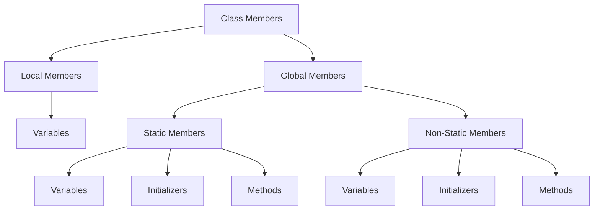

Trainer: Pavan Kumar | Java [AN: 1315 - 1600]

---

### Class Members

There are 3 things that can be defined for a class(class members):

1. Variables

2. Methods

3. Initializers (Constructors)

#### Classification of Class Members



##### Global Members

> The members which are defined with global scope are known as global members.

##### Local Members

> The members which are defined with local scope are known as local members.

```java
Class Student{
    // anything defined here is in global scope of the class
    method(){ // this method is also in global scope
    int x = 19; // x is a local member of the **method** 
    // anything inside this method is in local scope.

    }
    // anything defined here is also in global scope
}
```

In the above example, `method()` is a global member of `Student` class, while `x` is a local member of the `method()`.

##### Non-static Global members

> The global members which are declared without using the `static` keyword are called Non-static Global members.

```java
class Student{
    Student{}
    String name;
    method(){}
}
```

##### Static Global members

> The global members which are declared with the `static` keyword are called Static Global members.

```java
class Student{
    static Student{}
    static String name;
    static method(){}
}
```

##### Non-static variables

> The variable which is declared without static keyword is called non-static variable.

```java
class Student{
    String name;
    String course;
    int rollNum;
    int marks;
}
//Note that the default vaule of String is null and of int is 0;
```

###### Characteristics of Non-static Variables

>  Why are they needed? - To represent the real world entity properties in the form of non static variables

1. The non static variables are stored inside the object

2. They are assigned the default values.

3. Whenever a new object is created, all the variables are loaded inside each object.

4. These can be accessed with the help of object reference and with the non static variable name

The syntax used to access the variables stored within the object: `objectReference.variableName`, which would be done as follows on a student object s1:

```java
s1.name;
s1.course;
s1.rollNum;
s1.marks;
```

##### Constructors

> They are special non static members which are used to load and initialize the non-static variables

```java
accessModifiers ClassName(formalArgs){
    //initialization statements;
}
```

###### Characteristics of Constructors

1. Its name should be the same as the class name

2. It doesn't have any return type

3. Constructors execute during object creation

###### Types of constructors

1. Programmer-defined: 
   
   - No-argument constructor
   
   - Parameterized constructor

2. Compiler defined - Default constructor

###### Default Constructor

> When no constructors are defined inside the class, the compiler will add/define a **public** constructor in the class. 

###### No-argument/Non-parameterized Constructor

> The constructor which is defined by the programmer without formal arguments.

```java
class ClassName{
    accessModifier ClassName(){
    // initialization statements;
    }
}
```

##### Parameterized Constructor

> Constructor which is defined by the programmer using formal arguments.

```java
class ClassName{
    accessModifiers ClassName(formal parameters){
        //initialization statements;
    }
}
```

###### Constructor Overloading

> Defining multiple constructors with different formal arguments is known as constructor overloading 

```java
class ClassName{
    ClassName(){}
    ClassName(param1){}
    ClassName(param1, param2){}
    //and so on
}
```

---

#### Code exercise

1. Write a program to use non-static variables in a class, and access them
   
   - Code:
     
     ```java
     public class NonStaticStudentDemo {
         public static void main(String[] args) {
             Student s1 = new Student();
     
             System.out.println("Student Id: "+s1.studentId);
             System.out.println("Student Name: "+s1.name);
             System.out.println("Student course: "+s1.course);
             System.out.println("Student marks: "+s1.marks);
     
             s1.course = "AI";
             s1.name = "Sam";
             s1.marks = 55;
             s1.studentId = 1;
     
             System.out.println("Student Id: "+s1.studentId);
             System.out.println("Student Name: "+s1.name);
             System.out.println("Student course: "+s1.course);
             System.out.println("Student marks: "+s1.marks);
         }    
     }
     
     class Student{
         int studentId;
         int marks;
         String name;
         String course;
     }
     ```
   
   - Output: 
     
     ```bash
     Student Id: 0
     Student Name: null
     Student course: null
     Student marks: 0
     Student Id: 1
     Student Name: Sam
     Student course: AI
     Student marks: 55
     ```

2. Create a student class with a non parametrized constructor.
   
   - Code:
     
     ```java
     public class NonParameterizedStudent {
         public static void main(String[] args) {
             Student s1 = new Student();
     
     
             System.out.println("Student Id: "+s1.studentId);
             System.out.println("Student Name: "+s1.name);
             System.out.println("Student course: "+s1.course);
             System.out.println("Student marks: "+s1.marks);
             
         }
     }
     
     class Student{
         int studentId, marks;
         String name, course;
         public Student(){
             studentId = 1;
             name = "Adam";
             course = "AI";
             marks = 55;
         }
     }
     ```
   
   - Output:
     
     ```bash
     Student Id: 1
     Student Name: Adam
     Student course: AI
     Student marks: 55
     ```

3. Make a parameterized constructor for the student class
   
   - Code: 
     
     ```java
     public class ParameterizzedStudent {
         public static void main(String[] args) {
             Student s1 = new Student("Adam", "AI", 1, 55);
             Student.displayDetails(s1);
         }
     }
     
     class Student{
         String name, course;
         int marks, studentId;
     
         Student(String a, String b, int c, int d){
             name = a;
             course = b;
             studentId = c;
             marks = d;
         }
     
         public static void displayDetails(Student x){
             System.out.println();
             System.out.println("Student Id: "+x.studentId);
             System.out.println("Student Name: "+x.name);
             System.out.println("Student course: "+x.course);
             System.out.println("Student marks: "+x.marks);
             System.out.println();
         }
     }
     
     ```
   
   - Output:
     
     ```bash
     Student Id: 1
     Student Name: Adam
     Student course: AI
     Student marks: 55
     ```

4. Perform constructor overloading on Student class
   
   - Code: 
     
     ```java
     public class OverloadedConstructors {
         public static void main(String[] args) {
             Student[] students = {
                 new Student(1, 55),
                 new Student("James", "Programming"),
                 new Student("Evelyn", "Machine Learning"),
                 new Student("John", "Data Science", 4, 84)
             };
     
             for(Student x: students){
                 Student.displayDetails(x);
             }
         }
     }
     
     class Student{
         String name, course;
         int marks, studentId;
     
         Student(String a, int b){
             name = a;
             studentId = b;
         }
     
         Student(String a, String b){
             name = a;
             course = b;
         }
     
         Student(int a, int b){
             studentId = a;
             marks = b;
         }
     
         Student(String a, String b, int c, int d){
             name = a;
             course = b;
             studentId = c;
             marks = d;
         }
     
         public static void displayDetails(Student x){
             System.out.println();
             System.out.println("Student Id: "+x.studentId);
             System.out.println("Student Name: "+x.name);
             System.out.println("Student course: "+x.course);
             System.out.println("Student marks: "+x.marks);
             System.out.println();
         }
     }
     ```
   
   - Output:
     
     ```bash
     Student Id: 1
     Student Name: null
     Student course: null
     Student marks: 55
     
     Student Id: 0
     Student Name: James
     Student course: Programming
     Student marks: 0
     
     Student Id: 0
     Student Name: Evelyn
     Student course: Machine Learning
     Student marks: 0
     
     Student Id: 4
     Student Name: John
     Student course: Data Science
     Student marks: 84
     ```
     
     
