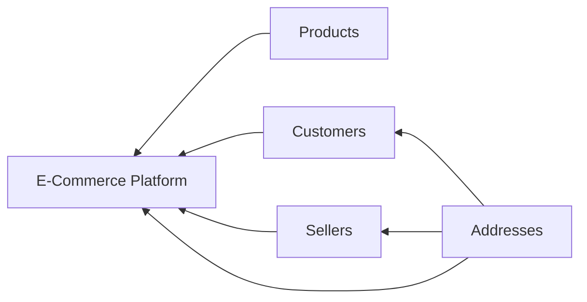

Trainer: Rohit Kumar | Java [FN: 0930 - 1230]

---

### Relationships in Java

> The connectivity/association between objects.

This can be achieved in two ways in java:

1. *has a* relationship

2. *is a* relationship

#### `has a` type relationship

> An object that is completely dependent on another object.

Consider a car and an engine object

`Engine` can exist without `Car`, while `Car` cannot exist without an `Engine`.

*Car `has a` Engine*.

Here, *Car* is the **Dependent**, while the Engine is the **Dependency**.


To create a `has a` type relatoinship, we simply store the reference of the dependency within the dependent object.

Consider this example:



Here, the E-commerce platform stores the products, customers, sellers and addresses in it. It **has** them. Also, Sellers have addresses, and customers have addresses too.

To perform this in java, the simple steps to be followed are: 

1. Create a reference variable of dependency object and store it inside the dependent object.

2. Create the object of the dependent object. 

There are two types of `has a` relatoinship: 

1. Early instantiation: create the dependency while the dependent is being created.

2. Lazy instantiation: this is achieved through **helper methods**, where we just initialize the dependency var without any values.

##### Early Instantiation

> As soon as the user creates the object of depending classs, the object of the dependency class is being created.

##### Lazy Instantiation

> When the user creates the object of depending class, the object of the dependency class is not created immediately and instead has to be initialized manually by the user via the helper methods when it is necessary.

#### Multiplicity

> One object depening on how many objects is called multiplicity.

There are four main types: 

1. One-to-One

2. One-to-Many

3. Many-to-One

4. Many-to-Many

#### `is a` type relationship

`is a` type relationship occurs in *inheritance*.

Consider an Engineer with the attributes: [Coding, Math]

Consider a Developer with the attributes: [GithubId, Coding, Math, Development]

Clearly, a Developer is also an Engineer, therefore, Developer `is a` Engineer.

We may consider Engineer to be the base class, while the Developer is the child class. Developer is inheriting the properties of the Engineer.

Engineer is a **General** role.

Developer is a **Specialist** role.

---

#### Code exercise

1. Create a Car and Engine class where Car is the Dependent, and Engine is the dependency.
   
   - Code: 
     
     ```java
     public class CarRelationship {
         public static void main(String[] args) {
             Car x = new Car();
             System.out.println("Car Model:"+ x.getModelName());
             x.setModelName("Model K");
             System.out.println("Car Model:"+ x.getModelName());
             System.out.println("Current Horsepower: "+x.getEngine().getHorsePower());
             x.setEngine(100);
             System.out.println("Current Horsepower: "+x.getEngine().getHorsePower());
         }
     }
     
     class Car{
         private String modelName;
         private Engine engine = new Engine();
     
         public String getModelName(){
             return modelName;
         }
     
         public void setModelName(String modelName){
             this.modelName = modelName;
         }
     
         public Engine getEngine(){
             return engine;
         }
     
         public void setEngine(int horsePower){
             engine.setHorsePower(horsePower);
         }
     
         public Car(){
             System.out.println("Car has been created. Set the modelname.");
         }
     
         public Car(String modelName){
             setModelName(modelName);
         }
     
     }
     
     class Engine{
         private int horsePower;
     
         public void setHorsePower(int horsePower){
             this.horsePower = horsePower;
         }
     
         public int getHorsePower(){
             return horsePower;
         }
     
         public Engine(){
             System.out.println("Created engine with unmarked horsepower.");
         }
     
         public Engine(int horsePower){
             setHorsePower(horsePower);
         }
     }
     ```
   
   - Output: 
     
     ```bash
     Created engine with unmarked horsepower.
     Car has been created. Set the modelname.
     Car Model:null
     Car Model:Model K
     Current Horsepower: 0
     Current Horsepower: 100
     ```

2. Perform early instantiation of tyres for a car object.
   
   - Code:
     
     ```java
     public class EarlyInstantiation {
         public static void main(String[] args) {
             Car x = new Car();
             System.out.println("Car tyres: ");
             for(Tyre t: x.tyres){
                 System.out.println(t.getBrand());
             }
         }
     }
     
     class Tyre{
         private String brand;
     
         public String getBrand(){
             return brand;
         }
     
         public void setBrand(String brand){
             this.brand = brand;
         }
     
         Tyre(){
             System.out.println("Initialized a tyre. Set brand name manually.");
         }
     
         Tyre(String brand){
             setBrand(brand);
         }
     }
     
     class Car{
         //This is early instantiation.
         Tyre[] tyres = {
             new Tyre("Appolo"),
             new Tyre("MRF"),
             new Tyre("Appolo"),
             new Tyre("MRF")
         };
     }
     ```
   
   - Output:
     
     ```bash
     Car tyres: 
     Appolo
     MRF
     Appolo
     MRF
     ```

3. Perform Lazy instantiation of tyres of a car object
   
   - Code: 
     
     ```java
     public class LazyInstantiation {
         public static void main(String[] args) {
             Car x = new Car();
     
             System.out.println("Car tyres: ");
             for(int i = 0; i<x.getNumberOfTyres(); i++){
                 System.out.println("Brand of tyre "+(i+1)+" is "+x.getTyre(i));
             }
         }
     }
     
     class Tyre{
         private String brand;
     
         public String getBrand(){
             return brand;
         }
     
         public void setBrand(String brand){
             this.brand = brand;
         }
        
     
         Tyre(){
             System.out.println("Initialized a tyre. Set brand name manually.");
         }
     
         Tyre(String brand){
             setBrand(brand);
         }
     }
     
     class Car{
         private String model;
         private Tyre[] tyres = new Tyre[4];
     
         public void setModel(String model){
             this.model = model;
         }
     
         public String getModel(){
             return model;
         }
     
         public void setTyre(int index, Tyre tyre){
             this.tyres[index] = tyre;
         }
     
         public String getTyre(int index){
             if(tyres[index] == null){
                 setTyre(index, new Tyre("Default Brand"));
                 System.out.println("Lazily assigned tyre "+(index+1)+" brand.");
             }
             return tyres[index].getBrand();
         }
     
         public int getNumberOfTyres(){
             return tyres.length;
         }
     }
     ```
   
   - Output:
     
     ```bash
     Car tyres: 
     Lazily assigned tyre 1 brand.
     Brand of tyre 1 is Default Brand
     Lazily assigned tyre 2 brand.
     Brand of tyre 2 is Default Brand
     Lazily assigned tyre 3 brand.
     Brand of tyre 3 is Default Brand
     Lazily assigned tyre 4 brand.
     Brand of tyre 4 is Default Brand
     ```
