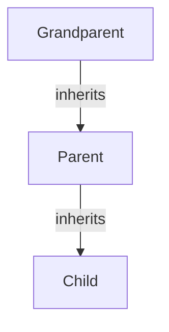
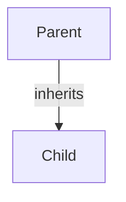

Trainer: Pavan Kumar | Java [AN: 1315 - 1600]

---

#### `is a` type relationship

 `is a` type relationship is essentially Inheritance.



Here, the properties and behavior or the Grandparent is inherited by the parent along with its own properties and behavior, which is in turn inherited by the child class. So grandparent contains p1, b1. Parent contains p1, b1, and its own p2, b2. Child contains p1, b1, p2, b2, and its own p3, b3.

In java, to achive inheritance, we make use of 2 keywords: 

1. `extends`

2. `implements`

In java we can perform inheritance with the help of components known as class as interface.

Inheritance from one class to another happens through `extends` keyword, while the keyword `implements` or `extends` are used when it happens through an interface.

1. Class A -> Class B : `extends`

2. Interface A -> Inteface B: `extends`

3. Interface A -> Class A: `implements`

#### Types of inheritance

1. Single level Inheritance

2. Multilevel Inheritance

3. Hierarchical Inheritance

4. Multiple Inheritance

##### Single Level Inheritance

In single level inheritance, one parent class(superclass) is sharing the properties and behaviors to a single child class(subclass).



There is only one level of inheritance here.

```java
class Parent{
    int a;
    int b;
    void m1(){}
    void m2(){}
}


class Child extends Parent{
    int c;
    int d;
    void m3(){}
    void m4(){}
}
```

In the above example, Child has access to a, b, m1, m2 since it inherits the methods and properties from its parent class via inheritance.

##### `super()`

`super()` call is a constructor call statement.

It is used to call the parent class constructor.

Through the `super()` call, we can load the parent class members in the child class object.

We can also pass arguments in the `super()` call to initialize the parent class members.

>  When a child object is created, through `Child x = new Child()`, the Child object is created first. Then, when the Child constructor calls `super()`, the parent object is also created within.

---

#### Code exercise

1. Perform and demonstrate single level inheritance 
   
   - Code:
     
     ```java
     public class SingleLevelInheritance {
         public static void main(String[] args) {
             Child one = new Child();
             System.out.println(one.a + one.b + one.c + one.d);
             one.method1();
             one.method2();
             one.method3();
             one.method4();
         }
     }
     
     class Parent{
         int a = 10;
         int b = 20;
         
         public void method1(){
             System.out.println("Printing from parent method1");
         }
     
         public void method2(){
             System.out.println("Printing from parent method2");
         }
     }
     
     class Child extends Parent{
         int c = 30;
         int d = 40;
     
         public void method3(){
             System.out.println("Printing from child method3");
         }
     
         public void method4(){
             System.out.println("Printing from child method4");
         }
     }
     ```
   
   - Output: 
     
     ```bash
     100
     Printing from method1
     Printing from method2
     Printing from method3
     Printing from method4
     ```

2. Create a program to demonstrate single level inheritance with super call.
   
   - Code:
     
     ```java
     public class BasicEmployee {
         public static void main(String[] args) {
             Manager manager = new Manager("Jason", 1000, 100);
             manager.displayDetails();
             manager.totalSalary();
         }
     }
     
     class Employee{
         String name;
         int salary;
     
         void displayDetails(){
             System.out.println("Employee: "+name+", Salary: "+salary);
         }
     
         Employee(String name, int salary){
             this.name = name;
             this.salary = salary;
         }
     }
     
     class Manager extends Employee{
         int bonus;
     
         void totalSalary(){
             System.out.println("Total Salary(including bonus): "+(bonus+salary));
         }
     
         Manager(String name, int salary, int bonus){
             super(name, salary);
             this.bonus = bonus;
         }
     }
     ```
   
   - Output:
     
     ```bash
     Employee: Jason, Salary: 1000
     Total Salary(including bonus): 1100
     ```
