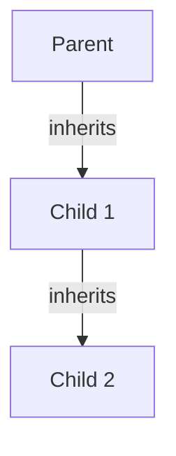
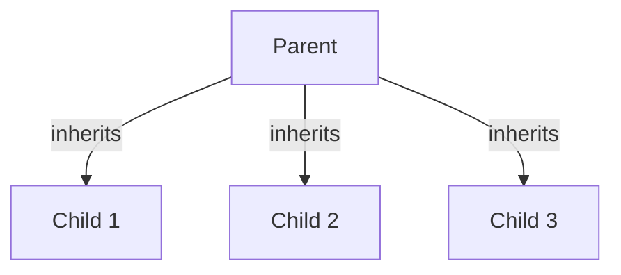
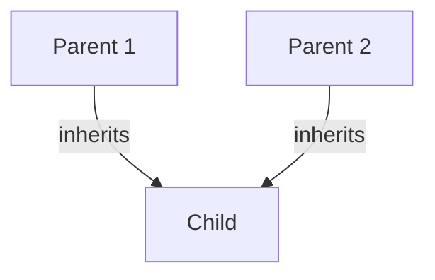
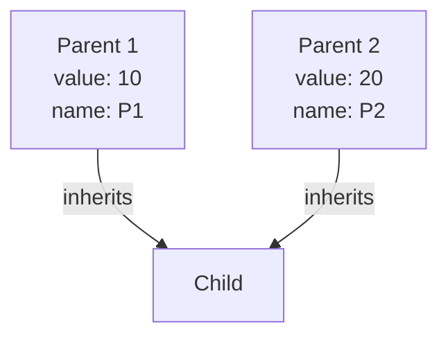
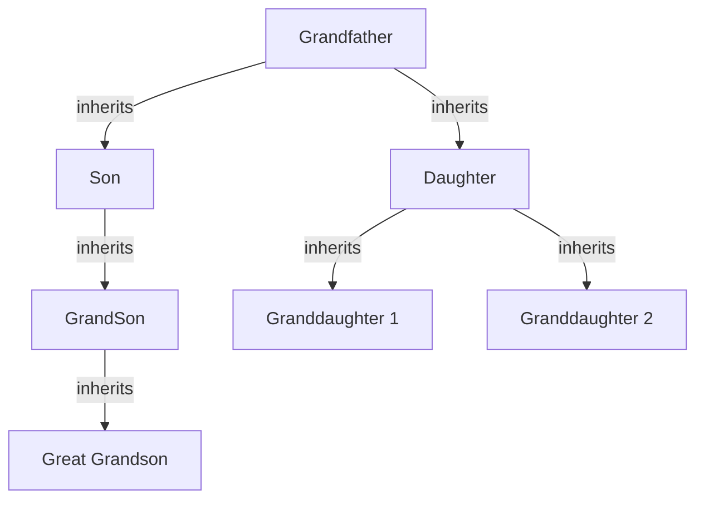

Trainer: Rohit Kumar | Java [FN: 0930 - 1230]

---

### super()

It is a constructor calling statement.

```java
class Parent{
    int i;
}
class Child extends Parent{
    int j;
}
```

The `super` keyword is used to access the attributes or properties of the superclass.

#### Characteristics of super()

1. Super calling statement has to be the first statement inside the constructor.

2. Super calling statement is implicit as well as explicit in nature.

3. There can be _n_ number of super calling statements in the constructor.
   
   - This means that if a child class does not have the super call statement, the compiler automatically adds the super() call (default, no arg call only) at the start of the constructor of the child.
   
   - This also means that if there is no default constructor inside the parent class, that javac will throw a **compile time error**.

### super

It is a keyword

It is used to access the properties of parent class into the child class' non-static context.


| `super()`                                                      | `super`                                                                                                               |
|:--------------------------------------------------------------:|:---------------------------------------------------------------------------------------------------------------------:|
| super() is used to call the immediate parent class constructor | super is used to access static and non-static members from the parent class into the child class' non-static context. |
| this call is generally placed inside the child constructor.    | super is placed in any non-static context.                                                                            |
| it has to be the first statement in the constructor            | super can be written anywhere within the non-static context                                                           |

| `super()`                                                              | `this()`                                                        |
| ---------------------------------------------------------------------- | --------------------------------------------------------------- |
| `super()` is used to call the immediate parent class constructor.      | `this()` is used to call the constructor within the same class. |
| `super()` can be written in all the constructors.                      | `this()` can be written in  _n-1_ constructor.                  |
| `super()` is implicit in nature, it can be defined explicitly as well. | `this()` call statement written explicitly.                     |

NOTE: `super()` call can only be used when there is no `this()` inside the constructor.

#### Multilevel Inheritance



#### Heirarchical Inheritance



#### Multiple Inheritance



##### Limitation of Mulitple inheritance

While trying to perform mulitple inheritance in java, we enounter the _Diamond Problem_ in java.

To overcome this, we make use of **Interfaces**, therefore mulitple inheritance is possible through interfaces.

###### Diamond Problem



Here, when trying to access the value/name attribute, the child will be confused about which parent's attribute to access. This, precisely is the diamond problem. 

In mulitple inheritance, the constructor of child class will have a super statement and that super statement will be confused to call which class parent constructor. This gives rise to ambiguity 

#### Hybrid Inheritance

This is generally a combo of heirarchical and multilevel(or multiple through interfaces) inheritance. Example:



---

#### Code exercise

1. Test how initializers work with inheritance. // This wasn't actually done. I tried this out of curiosity.
   
   - Code:
     
     ```java
     public class InheritanceInitializerTest {
         public static void main(String[] args) {
             Child c = new Child();
         }
     }
     
     class Parent{
         {
             System.out.println("Parent says hello!");
         }
         Parent(){
             System.out.println("Parent constructor says hello!");
         }
     }
     
     class Child extends Parent{
         {
             System.out.println("Child says hello!");
         }
     
         Child(){
             super();
             System.out.println("Child constructor says hello!");
     
         }
     }
     ```
   
   - Output:
     
     ```bash
     Parent says hello!
     Parent constructor says hello!
     Child says hello!
     Child constructor says hello!
     ```
   2. Perform simple single level inheritance and use the super() call.
   - Code: 
   
   ```java
   public class FatherSonInheritance {
       public static void main(String[] args) {
           Son s1 = new Son(1, "Able");
       }
   }
   
   class Father{
       String name;
   
       Father(String name){
           this.name = name;
       }
   }
   
   class Son extends Father{
       int sid;
   
       Son(int sid, String name){
           super(name);
           //instead of writing this.name = name, we call the constructor of super.
           this.sid = sid;
       }
   }
   ```
   
   3. Access properties in the parent class using the super keyword.
   - Code:
     
     ```java
     public class UsingSuperForAttributes {
         public static void main(String[] args) {
             Son x = new Son();
             System.out.println("Son's name: "+x.name);
             System.out.println("Father's name: "+x.fatherName);
         }
     }
     class Parent{
         String name = "Allen";
     }
     
     class Son extends Parent{
         String name = "Patrick";
         String fatherName = super.name;
     }
     ```
   
   - Output: 
     
     ```bash
     Son's name: Patrick
     Father's name: Allen
     ```

2. Create a shape class to demonstrate multilevel inheritance.
   
   - Code:
   
   ```java
   public class TriangleInheriter {
       public static void main(String[] args) {
           Shape shape1 = new Shape();
           shape1.computeArea();
           Triangle triangle1 = new Triangle();
           triangle1.computeArea(2,3,4);
           RightAngledTriangle rightTriangle1 = new RightAngledTriangle();
           rightTriangle1.computeArea(2,3);
       }
   }
   class Shape{
       void computeArea(){
           System.out.println("Override this to actually calculate the area.");
       }
   }
   
   class Triangle extends Shape{
       void computeArea(double a, double b, double c){
           double semi = (a+b+c)/2;
           double area = Math.sqrt(semi*(semi-a)*(semi-b)*(semi-c));
           System.out.println("Area of the triangle is: "+area);
       }
   }
   
   class RightAngledTriangle extends Triangle{
       void computeArea(double base, double height){
           double area = base*height/2;
           System.out.println("Area of the right angled triangle is: "+area);
       }
   }
   ```
   
   - Output:
     
     ```bash
     Override this to actually calculate the area.
     Area of the triangle is: 2.9047375096555625
     Area of the right angled triangle is: 3.0
     ```

3. Demonstrate Heirarchical Inheritance on shape
   
   - Code:
     
     ```java
     public class ShapeInheritance {
         public static void main(String[] args) {
             Shape s1 = new Shape();
             s1.calculateArea();
             Square square1 = new Square(10);
             square1.calculateArea();
             Rectangle rectangle1 = new Rectangle(10, 20);
             rectangle1.calculateArea();
             Circle circle1 = new Circle(10);
             circle1.calculateArea();
         }
     }
     class Shape{
         void calculateArea(){
             System.out.println("implement the functionality.");
         }
     }
     class Square extends Shape{
         int length;
     
         Square(int length){
             this.length = length;
         }
     
         void calculateArea(){
             int area = length * length;
             System.out.println("Area of square "+area);
         }
     }
     
     class Circle extends Shape{
         double radius;
     
         Circle(double radius){
             this.radius = radius;
         }
     
         void calculateArea(){
             double area = (22.0/7)*radius*radius;
             System.out.println("Area of Circle "+area);
         }
     }
     
     class Rectangle extends Shape{
         int length;
         int breadth;
     
         Rectangle(int length, int breadth){
             this.length = length;
             this.breadth = breadth;
         }
     
         void calculateArea(){
             int area = length * breadth;
             System.out.println("Area of rectangle "+area);
         }
     }
     ```
   
   - Output:
     
     ```bash
     Area of square 100
     Area of rectangle 200
     Area of Circle 314.2857142857143
     ```
