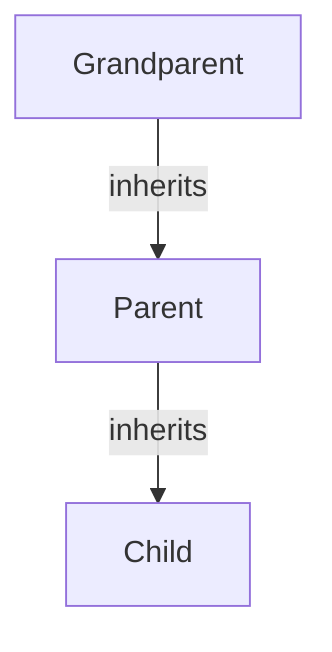
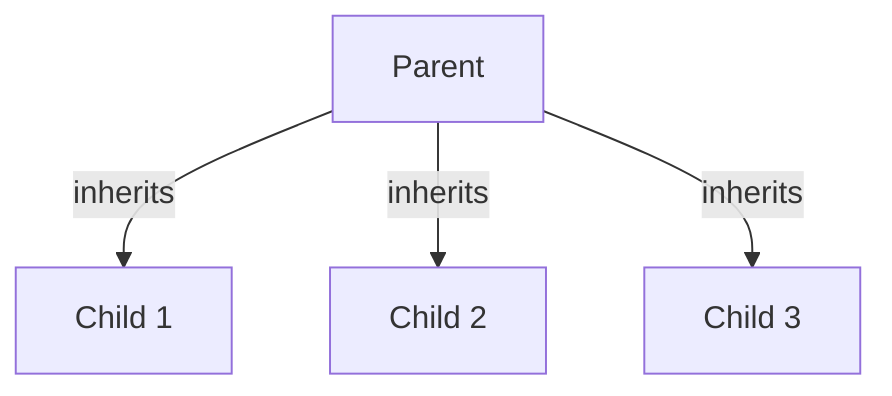
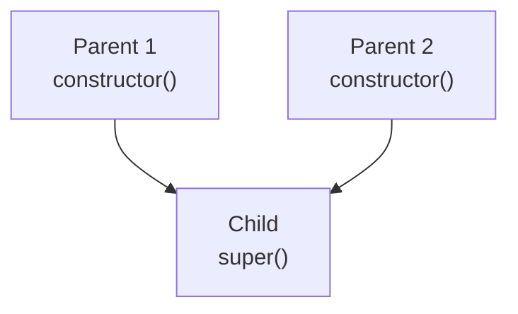

Trainer: Pavan Kumar | Java [AN: 1315 - 1600]

---

When inheritance happens, the child class inherits all the properties and methods from the parent and also has its own properties and methods.

### Multilevel Inheritance



Here, the child has all the properties of the parent and the grandparent while the parent will also have all the properties of the grandparent as well.

### Heirarchical Inheritance

Here, we have one parent class sharing atrributes and methods with multiple child classes.



### Multiple Inheritance



Here, the child calls super, and gets confused about which parent's constructor to actually use. This is the **diamond problem**.

Therefore, mulitple inheritance is not possible with classes, but it can be done using *interfaces*, since interfaces do not use constructor.

### Non-primitive Type-casting

> The process of changing the reference from one non-primitive type to another non-primitive type is called non-primitive type-casting.

It is classified into two categories:

1. Up-casting

2. Down-casting

Note that non-primitive datatype here is referening to class.

#### Up-casting

> The process of storing the object of child class object in parent class reference variable is called Up-casting.

Whenever up-casting is performend, we can only access the parent class members.

`is a` relationship is **mandatory** between the two classes for this to happen.


---

#### Code exercise

1. Create a student class and result class, and use single level inheritance to calculate the grade based on the marks.
   - Code:
     
     ```java
     public class StudentStats {
         public static void main(String[] args) {
             Result rx = new Result("Adam",87);
             Result ry = new Result("James", 79);
             rx.calculateGrade();
             ry.calculateGrade();
         }
     }
     class Student{
         int marks;
         String name;
     
         public Student(String name, int marks){
             this.name = name;
             this.marks = marks;
         }
     
         public void displayDetails(){
             System.out.println("Student name: "+name+" Student mark: "+marks);
         }
     }
     
     class Result extends Student{
     
         String grade;
     
         public Result(String name, int marks){
             super(name, marks);
         }
     
         void calculateGrade(){
             if(marks > 90){
                 grade = "A";
             }else if(marks > 80){
                 grade = "B";
             }else{
                 grade = "F";
             }
             displayDetails();
             System.out.println("Student grade: "+grade);
         }
     }
     ```
- Output:
  
  ```bash
  Student name: Adam Student mark: 87
  Student grade: B
  Student name: James Student mark: 79
  Student grade: F
  ```
2. Use multilevel inheritance to model a university, college, department relation
   
   - Code:
     
     ```java
     public class UniSystem {
         public static void main(String[] args) {
             Department dept = new Department("Illegitimate Uni", "Z-com", "Biological Warfare");
             dept.displayDept();
         }
     }
     class University{
         String uniName;
     
         public University(String uniName){
             this.uniName = uniName;
         }
     
         void displayUni(){
             System.out.println("University: "+uniName);
         }
     }
     
     class College extends University{
     
         String collegeName;
     
         public College(String uniname, String collegeName){
             super(uniname);
             this.collegeName = collegeName;
         }
     
         void displayCollege(){
             displayUni();
             System.out.println("College name: "+collegeName);
         }
     }
     
     class Department extends College{
     
         String deptName;
     
         public Department(String uniname, String collegename, String deptname){
             super(uniname, collegename);
             this.deptName = deptname;
         }
     
         void displayDept(){
             displayCollege();
             System.out.println("Department Name: "+deptName);
         }
     }
     
     ```
- Output:
  
  ```bash
  University: Illegitimate Uni
  College name: Z-com
  Department Name: Biological Warfare
  ```
3. Demonstrate Up-casting using a simple example.
   
   - Code: 
     
     ```java
     public class UpCastingDemo {
         public static void main(String[] args) {
             Book p1 = new Pen();
             p1.m1();
             System.out.println(p1.a);
             System.out.println(p1.b);
             // System.out.println(p1.c); the vars and methods in pen class is not accessible.
         }    
     }
     class Book{
         int a = 10;
         int b = 20;
     
         void m1(){
             System.out.println("parent method");
         }
     }
     
     class Pen extends Book{
         int c = 30;
         int d = 40;
     
         void m2(){
             System.out.println("child method");
         }
     }
     ```
- Output: 
  
  ```bash
  parent method
  10
  20
  ```
