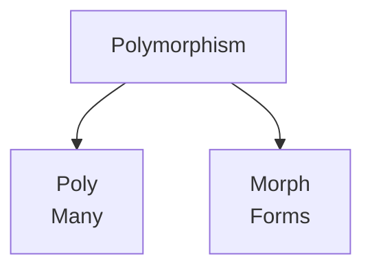
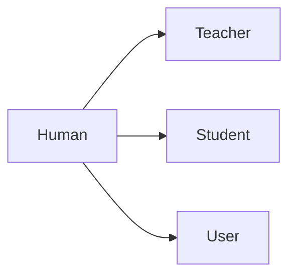
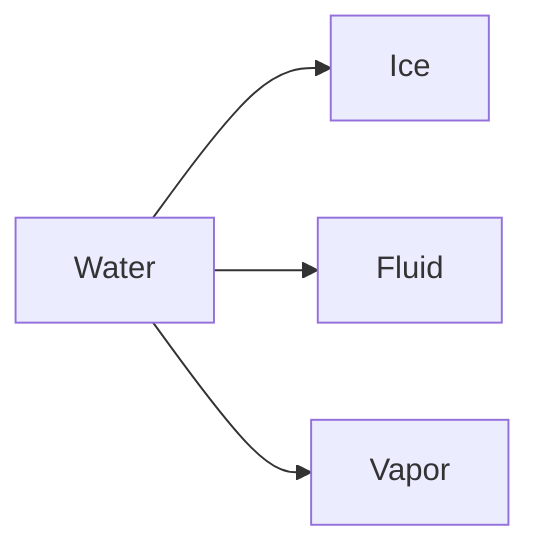

Trainer: Pavan Kumar | Java [AN: 1315 - 1600]

---

#### Up-Casting

Essentially about storing child class component in parent class object.

#### Down-Casting

> The process of storing the parent class object in child class reference variable is known as down-casting.

Without performing up-casting, if down-casting is done, we get a `Class cast exception`. Therefore it is mandatory to upcast before downcasting.

Down casting helps us to access both parent class members along with child class members.

To perform down-casting, we must use the typecast operator.

```java
ChildClass referenceVar = (ChildClass) objectOfParentClass
```

Consider the following example:

```java
Class Book{
    
}
Class Pen extends Book{
    
}

//in main

Book b = new Pen();
Pen p = (Pen) b;
```

### Polymorphism

> The ability of an entity or an object having many forms and having many behaviors according to the situations is called Polymorphism.



Consider these examples to relate the idea with real world behavior:



Human, for example behaves in many different ways based on the situation.



Similarly with water as well, its state or behavior changes based on the temprature.

This is achived in java through **methods**. This is simply because we can make an entity behave differently using different methods.

Polymorphism is of two types in java: 

- Complie-time polymorphism

- Run-time polymorphism

#### Compile time polymorphism

> The process of binding the method calling statement and method signature done during compile time by the compiler is known as compile-time polymorphsim.

This is done using: 

- Constructor overloading 

- Method overloading

When java is translated into machine level code, it flow through two types of translations: 

- Compilation: Java -> Bytecode

- Interpretation: Bytecode -> Binary

Binding between methods and method calls is done during compilation.

#### Run time polymorphism

> The process of binding the method calling statement and method signature is done by the JVM at run time is known as Run-time polymorphism

Overriding is simply modifying things that are already present.

##### Method Overriding

> The process of changing the parent class method implementation in child class method is called **Method overriding**.

To perform method overriding, inheritance is **MANDATORY** between the classes.

When we are overriding a method, the method declaration should be same in the parent class as well as in the child class but the implementation must be different.


---

#### Code exercise

1. Write a simple program to demonstrate downcasting
   
   - Code:
     
     ```java
     public class DownCastingExample {
         public static void main(String[] args) {
             Book book1 = new Pen();
             Pen pen1 = (Pen) book1;
     
             System.out.println("All the attributes and methods accessible through downcasting: ");
             System.out.println(String.format("%d %d %d %d",pen1.a, pen1.b, pen1.c, pen1.d) );
             pen1.method1();
             pen1.method2();
             
             System.out.println("All the attributes and methods accessible through upcasting.: ");
             System.out.println(String.format("%d %d", book1.a, book1.b));
             book1.method1();
         }
     }
     
     class Book{
         int a = 10;
         int b = 20;
     
         void method1(){
             System.out.println("Printing hello from parent method");
         }
     }
     
     class Pen extends Book{
         int c = 30;
         int d = 40;
     
         void method2(){
             System.out.println("Printing hello from child method");
         }
     }
     ```
   
   . Output:
     
     ```bash
     All the attributes and methods accessible through downcasting: 
     10 20 30 40
     Printing hello from parent method
     Printing hello from child method
     All the attributes and methods accessible through upcasting.: 
     10 20
     Printing hello from parent method
     ```

2. Demonstrate method overloading used in polymorphism
   
   - Code:
     
     ```java
     public class MethodOverloadingForPolymorphism {
         public static void main(String[] args) {
             Calc x = new Calc();
             x.add();
             x.add(1,2);
             x.add(1,2,3);
             x.add(1,2,3,4);
         }
     }
     
     class Calc{
         public void add(){
             System.out.println("Nothing to add");
         }
     
         public void add(int a, int b){
             System.out.println(a+b);
         }
     
         public void add(int a, int b, int c){
             System.out.println(a+b+c);
         }
     
         public void add(int a, int b, int c, int d){
             System.out.println(a+b+c+d);
         }
     }
     ```
   
   . Output:
     
     ```bash
     Nothing to add
     3
     6
     10
     ```

3. Demonstrate method overriding
   
   - Code:
     
     ```java
     public class PolymorphicAnimal {
         public static void main(String[] args) {
             Animal a = new Animal();
             Cat b = new Cat();
             Dog c = new Dog();
             a.sound();
             b.sound();
             c.sound();
         }
     }
     
     class Animal{
         void sound(){
             System.out.println("Animal made some sound");
         }
     }
     
     class Cat extends Animal{
         @Override // generally only written when dealing with advanced java, in oops, it is not necessary
         void sound(){
             System.out.println("M E O W");
         }
     }
     
     class Dog extends Animal{
         @Override
         void sound(){
             System.out.println("W O O F");
         }
     }
     ```
   
   . Output:
     
     ```bash
     Animal made some sound
     M E O W
     W O O F
     ```
