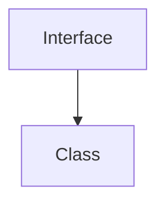

Trainer: Pavan Kumar | Java [AN: 1315 - 1600]

---

#### Concrete Methods

```java
class Concrete{
    vars
    methods
    initializers
    constructors
    inner class
}
```

An object of the Concrete class can be created.

#### Abstract Methods

```java
abstract class Abstract{
    vars
    static methods
    abstract methdos
    constructors
    initializers
}
```

An object of the Abstract class **cannot** be created.

Static members of the abstract classes can be accessed using the `Classname.StaticMember` format, the non-static members however, cannot be accessed.

### Interface

> Interface is a component in java we can create this interface component using the keyword `interface`.

Through interfaces, we can achieve full abstraction and multiple inheritance as well.

Interface contains static methods, variables, default methods and abstract methods.

Interface does not contain constructor and it also doesnt contain initializers.

The variables in interface are **public static final**, and the methods are public.

With the help of interfaces, we can achieve loose coupling.

An object cannot be created for an interface.

```java
interface ix{
    variables
    abstract methods
    static methods
    default methods
}
```

To perform inheritance between interface and a class, we need to make use of the `implements` keyword



There are different types of interfaces: 

1. Functional Interface: One Abstract method

2. Marker Interface: No abstract method

3. Normal Interface: Everything is allowed


---

#### Code exercise

1. Write a program to demonstrate abstraction by creating an abstract class Person, and multiple child classes that implement its methods.
   
   - Code
     
     ```java
     public class AbstractWorker {
         public static void main(String[] args) {
             Worker[] list = {
                 new Teacher(),
                 new Student(),
                 new Developer()
             };
     
             for(Worker x: list){
                 x.work();
             }
         }
     }
     
     abstract class Worker{
         abstract void work();
     }
     
     class Teacher extends Worker{
         void work(){
             System.out.println("Teacher is grading papers.");
         }
     }
     
     class Student extends Worker{
         void work(){
             System.out.println("Student is studying.");
         }
     }
     
     class Developer extends Worker{
         void work(){
             System.out.println("Developering is developing a new application.");
         }
     }
     ```
   
   . Output: 
     
     ```bash
     Teacher is grading papers.
     Student is studying.
     Developering is developing a new application.
     ```

2. Make a simple interface that has components
   
   - Code: 
     
     ```java
     interface Demo{
         public static final int a= 101;
         public static void m1(){
             System.out.println("interface method");
         }
         public void m2();
         default void m3(){
             System.out.println("default method");
         }
     }    
     ```

3. User interface to implement vehicle and car
   
   - Code
     
     ```java
     public class InterfaceVehicle {
         public static void main(String[] args) {
             Car x = new Car();
             x.start();
         }
     }
     interface Vehicle{
         void start();
     }
     
     class Car implements Vehicle{
         @Override
         public void start(){
             System.out.println("Car is starting");
         }
     }
     ```
   
   . Output: 
     
     ```bash
     
     ```
     
     
